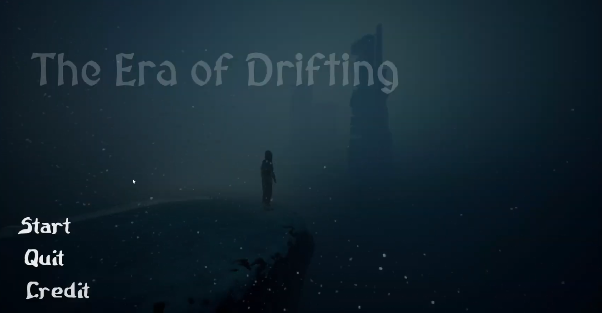
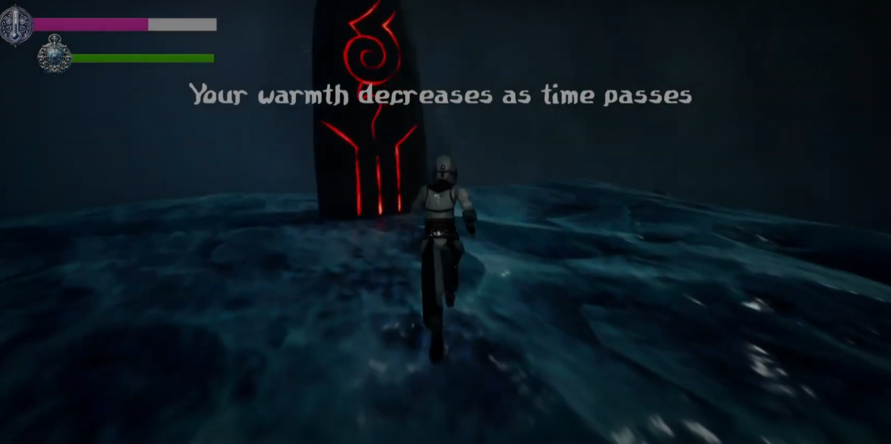
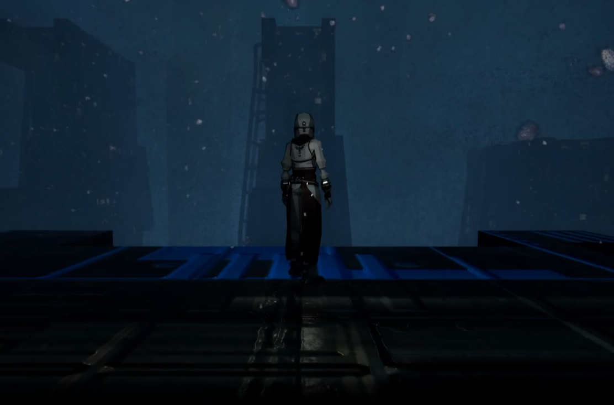
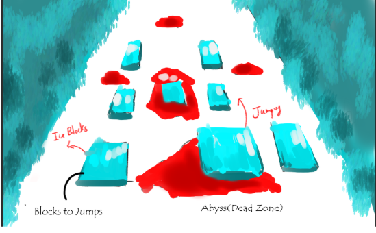
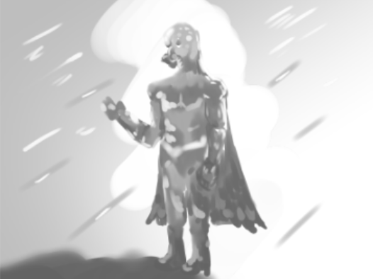
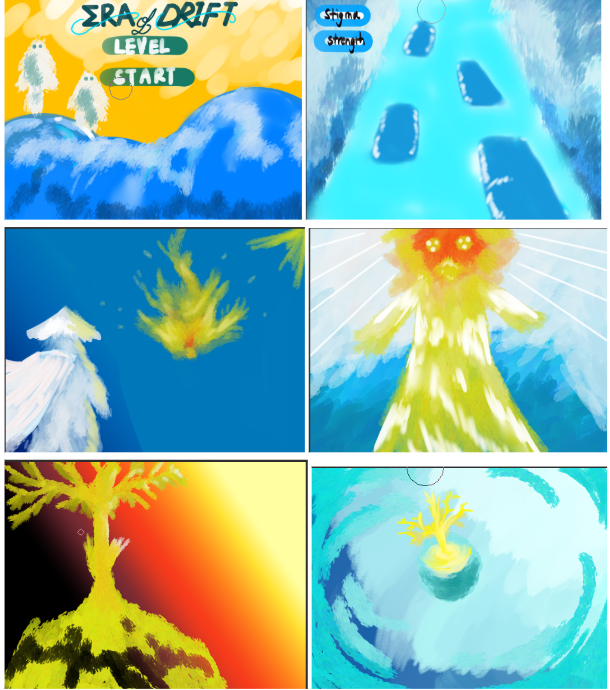

# Game Title | The Era of Drifting

Team members: Mengxuan Huang, Yueyang Li
## 0 Game Demo
Game Title

Game play

## 1 Executive Summary

"The Era of Drifting" is a high-octane action platformer game that offers a unique twist to the genre. Set in an expansive world where friction is a mere concept, players are challenged to master the art of momentum and acceleration. To survive in the treacherous cold, you are forced to pursue the Bonfires.

The core mechanic of The Era of Drifting revolves around the kinetic dance of pushing ice blocks and performing wall-bounce-and-jump to achieve the necessary speed to traverse otherwise impassable areas. The ice blocks might lie dormant, waiting for the player's touch to awaken their potential. It is a game that demands precision and agility, as players must learn to seamlessly push the ice, bounce off walls, and glide across chasms with a thrilling sense of speed.

The Era of Drifting is an adrenaline-fueled journey that simulates real-world physics in a frictionless environment. In the beginning, players may find the controls challenging, struggling to synchronize their movements with the game's physics. Mastery is not immediate; it is earned through perseverance. With each attempt, players will improve their timing and reflexes, eventually achieving a fluid dance of motion that feels exhilaratingly fast and satisfying.The game's design encourages players to become intimately familiar with the mechanics of a world without friction, providing an intense and rewarding experience for those willing to take on the challenge.

Designed exclusively for the PC platform, The Era of Drifting promises to deliver quick, adrenaline-pumping gameplay that will captivate players with its rapid pace and unique physics-based challenges. The game's development is expected to be an agile process,   
with a projected completion timeline of 5 weeks, or approximately 42 man-hours, assuming a dedicated team of 3 part-time designers and developers. "*Get ready to dive headfirst into the realm of The Era of Drifting, where you'll conquer challenges and outlast the freeze before it's too late.*"

## 2 Game Design \- Creativity

### 2.1 High Concepts

“The Era of Drifting” designed by Yueyang, Mengxuan and Licheng, is a single player platformer that encourages the flow experience for players. The player should use the momentum to control their characters to step on the drifting friction block to avoid areas of abyss, where they fall to death. Friction blocks might be originally still and players need to hit them to get them transferred. The players can also jump from a fast moving block to produce “Ultimate Jump” to jump farther. The players’ goal is to reach the Bonfire by passing those abyss on the map. 

### 2.2 Design Goals

#### 2.2.1 Main Design Features

##### 2.2.1.1 Player goals and objectives.

The primary objective is to navigate through a physics-based, frictionless environment to reach the end of each level. The player must harness the momentum to overcome intervals and obstacles, using ice blocks as a means of transport and mastering the wall-bounce-and-jump technique to advance.

Secondary objectives include mastering the game's unique mechanics to achieve a state of flow, where the challenge and ability are perfectly balanced, keeping the player engaged and immersed in the experience.

##### 2.2.1.2 Main rules and procedures

Operational rules – The player controls a character that moves in a frictionless world, utilizing momentum to overcome various challenges. The character's movement is influenced by player input and the physics of the game environment.

Main game mechanic – The player must learn to control their speed and trajectory by interacting with the environment. This includes running, jumping, using ice blocks, and the bullet-time ability.

##### 2.2.1.3 Boundaries and Constraints

The player's movement is constrained by the game's physics and the level design. There are set start and end points for each level, and the player cannot deviate from the designated path. The levels are designed to challenge the player's understanding, with limited opportunities for resting or stopping completely.

#### 2.2.2 Appeal

What is the game genre?  
Action platformer with physics-based mechanics

Who is the target audience?  
Gamers who enjoy challenging, skill-based platformers and are interested in physics-based gameplay.

What is their age?  
Suitable for all ages, but particularly appealing to players aged 13 and above, who can appreciate the complexity of the physics mechanics.

Why is the game fun to play?  
The game provides a unique twist on traditional platformers by requiring players to think about movement in a new way due to the lack of friction. Each level presents a distinct challenge with an array of obstacles to overcome, ensuring a fresh experience throughout. The joy of mastery and the satisfaction of successfully navigating through a difficult segment provide a rewarding experience for players.

#### 2.2.3 Look And Feel

### 2.3 Worlds, Characters, and Story

#### 2.3.1 Back Story

In a time lost to the frost of a vengeful enchantress, the world lay imprisoned in ice, its very motion halted by a curse that stripped away all friction. This was the malevolent work of the Witch of Forever Frozen, whose heart knew no warmth.

Humanity, now called Drifters, clung to survival in a world where every step was a slide into the unknown. They sought the Bonfire, a mythic place untouched by the witch's icy hand, where life persisted and hope flourished.

Using ingenuity to defy their bleak reality, the Drifters sailed across the glassy waste with sleds, their bonds of unity providing the only grip in a life that had become a perpetual glide. Their eyes were ever fixed on the horizon, where it was said the sun still kissed the earth with golden rays of old.

They were a mosaic of courage: an inventor whose creations defied the endless slide, an elder with wisdom deep as the ancient roots, and a fiery spirit whose defiance melted the very ice beneath her feet.

Their journey was fraught with dangers: unknown traps, seemingly impassable cracks, and freezing chill that could be lethal. In the heart of the endless winter, they found not just the hope of the Bonfire, but the possibility of spring—a chance to thaw the frozen reign of the Witch of Forever Frozen and let life dance freely once again.

#### 2.3.2 Spaces / Worlds

Slider Zone Concept  

#### 2.3.3 Characters

A typical Slider-Man On the waste Land 

#### 2.3.4 Levels of Difficulties 

The higher the levels, the more abyss on the surface

### 2.4 Interaction Models

#### 2.4.1 User Interface \- Navigation and Movement

* Control over keyboard and mouse  
* Game Play Sequence

#### 2.4.2 Game Play Sequences and Levels

The game follows a pretty Linear Pattern, in each level, you just have to use the momentum to avoid the abyss and approach your final destination.

## 3 Game Design \- Implementation Details

### 3.1 Design Assumptions

#### 3.1.1 System Requirements

|   | Minimum Requirement Specification | Recommended Requirement Specification |
| :---- | :---- | :---- |
| **Operating System** | Windows 10 64-bit version | Windows 10 64-bit version |
| **Processor** | I3 | i7 |
| **Memory** | 4 GB RAM | 8 GB RAM |
| **Graphics Card** | NVIDIA RTX-2000 series | NVIDIA RTX-2080 super and higher |
| **Storage** | 10 GB | 10 GB |

#### 3.1.2 Development Environments

| Operating System | Windows 10/11 64-bit version |
| :---- | :---- |
| **Processor** | i7 or higher |
| **Unreal Engine version** | 5.3.2 |
| **Graphics Card** | NVIDIA RTX-3060 laptop or higher |
| **Memory** | 16 GB |

#### 3.1.3 Algorithms and Techniques

The Era of Drifting harnesses the power of Unreal Engine 5's built-in physics engine for the frictionless character movements, its animation system for seamless transitions, and Niagara particles for immersive visual effects. This combination of technologies works in harmony to create a novel inertia-based gameplay experience.

### 3.2 Storyboards

### 3.3 Design Logic 

#### 3.3.1 Finite State Machines – Events/States/Effects.

#### 3.3.2 User Solution/Actions 

In The Era of Drifting, players have intuitive control using both mouse and keyboard. They can rotate their view with the mouse. The keyboard allows players to run and jump, essential for navigating the terrain and solving puzzles. Players have several key actions at their disposal to tackle the game's puzzles:

Push Ice Blocks: Players can push ice blocks to accelerate their movement. This allows for creative solutions to overcome obstacles and reach new areas.

Bullet-Time Ability: The bullet-time feature grants players the ability to slow down time momentarily. This can be used strategically to jump onto moving ice blocks, gaining higher speeds and accessing otherwise unreachable locations.

Fast Jumps from Moving Blocks: To maintain momentum and speed, players can execute fast jumps from moving blocks. Timing and precision are crucial here, as mastering this technique is key to progressing efficiently through the levels.

The ultimate goal for players is to skillfully utilize these actions, running, jumping, and strategizing their way to the final destination. Success lies in mastering the inertia-driven movement mechanics, creative use of ice blocks, and precise execution of jumps to overcome challenges and emerge victorious in The Era of Drifting.

### 3.4 Software Versions

#### 3.4.1 Alpha Version

The Alpha version of The Era of Drifting will establish the core infrastructure necessary to support the game concept. Key features to be implemented include:

* Frictionless player movement  
* Introduction of ice-block mechanics  
* Introduction of traps  
* Completion of Level 1

#### 3.4.2 Beta Version

The Beta version of the game will encompass a more comprehensive set of features, aiming to enhance the player experience and add depth to gameplay. Included in the Beta version are:

* Bullet-time ability for strategic maneuvers  
* Implementation of a menu system for navigation and settings  
* Inclusion of a tutorial level to guide players through mechanics  
* Expansion to Level 2, introducing new challenges and puzzles to overcome

#### 3.4.3 Tutorial Levels

The tutorial levels in The Era of Drifting gradually introduce players to the game's mechanics, starting with basic movement and jumping on frictionless ground. They then learn to accelerate ice blocks, master the bullet-time ability for precise jumps onto fast-moving ice blocks, and finally, use ice-block jumps to overcome seemingly impossible gaps. These tutorials will be at the beginning of each level serve as a comprehensive training ground, ensuring players are fully prepared for the challenges that await, as they learn to creatively combine abilities to navigate the intricate levels of The Era of Drifting.

## 4 Work Plan

### 4.1 Tasks

|  | Task | Due on | Member |
| :---- | :---- | :---- | :---- |
| 1 | Basic project setup | 2024/3/3 | Mengxuan |
| 2 | Game mechanism |  |  |
| 2.1 | Frictionless surface | 2024/3/8 | Mengxuan |
| 2.2 | Bullet time | 2024/3/8 | Yueyang |
| 2.3 | Moving ice blocks | 2024/3/8 | Yueyang |
| 3 | Game UI |  |  |
| 3.1 | HUD | 2024/3/13 | Yueyang, Mengxuan |
| 3.2 | Game menu | 2024/3/16 | Yueyang |
| 4 | Art design |  |  |
| 4.1 | Search assets |  | All |
| 4.2 | Scene improvement | 2024/3/31 | Yueyang |
| 4.3 | Various effects | 2024/3/21 | All |
| 5 | Level design | 2024/3/21 |  |
| 5.1 | Development scene | 2024/3/10 | All |
| 5.2 | Level 1 | 2024/3/19 | All |
| 5.3 | Level 2 | 2024/3/19 | All |
| 6 | Playtest |  |  |
| 6.1 | Playtest1 | 2024/3/13 | All |
| 6.2 | Playtest2 | 2024/3/24 | All |
| 7 | Extra features and tuning |  |  |

### 4.2 Milestones

#### 4.2.1 Minor

* Basic game mechanism:   
  * frictionless surface  
  * bullet time  
  * Moving ice blocks  
* Sample level  
* Game levels:   
  * Level 1  
  * Level 2   
* Level management  
* Game UI  
* Scene improvement  
* Various effects  
  * Visual effects  
  * Sound effects

#### 4.2.2 Major

* Alpha version  
  * In this version, our primary objective is to incorporate the core game mechanism and develop a sample level for playtesting. This will enable us to gather feedback from others and enhance the game. Additionally, we aim to integrate functionality allowing for level resets to facilitate efficient level management.  
* Beta version  
  * In this version, our goal is to complete the level design of the game and ensure the functionality of the level manager. This will enable players to restart a level or proceed to the next one upon completion. Additionally, we anticipate finalizing the game's user interface (UI) so that we can concentrate on refining the gameplay, incorporating art assets, and enhancing visual and sound effects in the final week.

